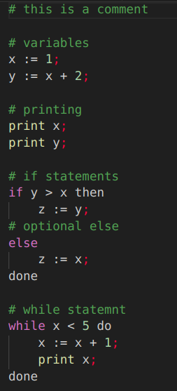
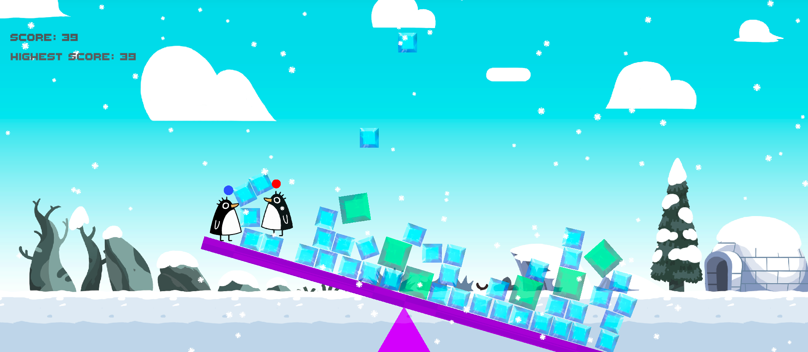
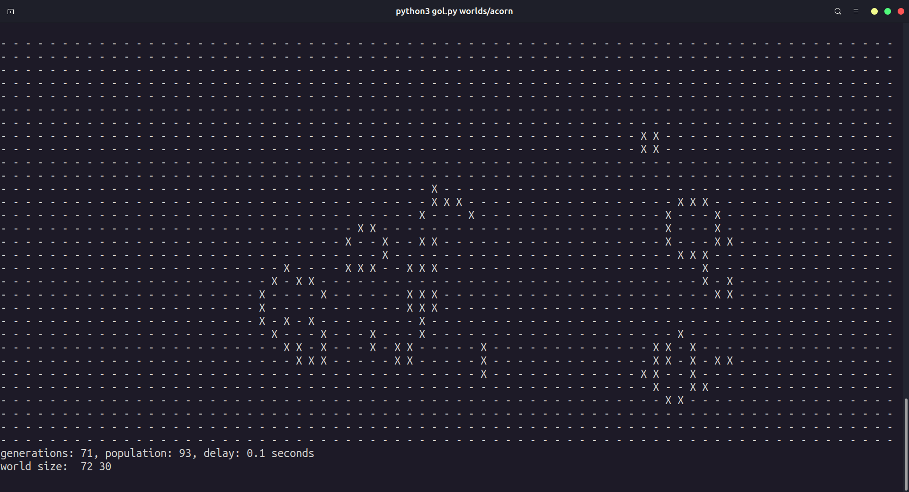
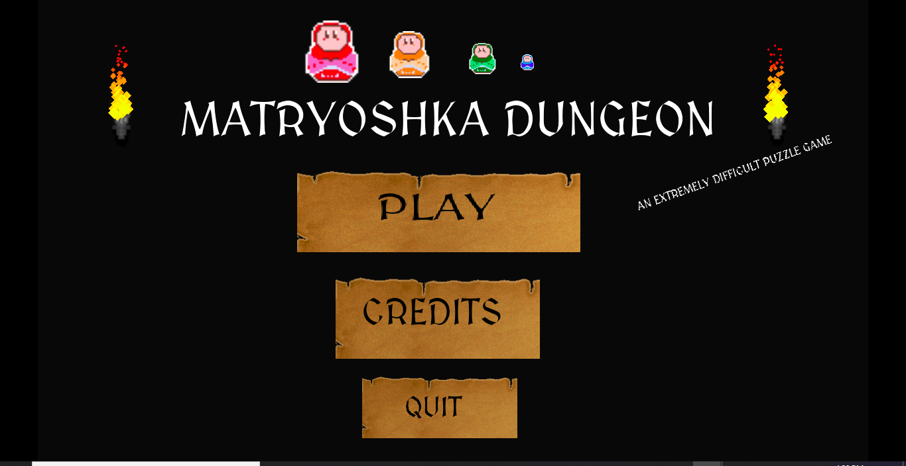
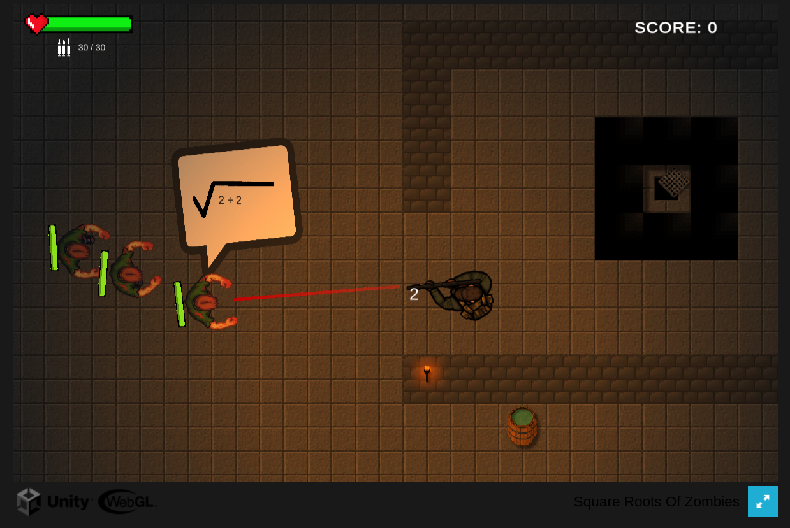
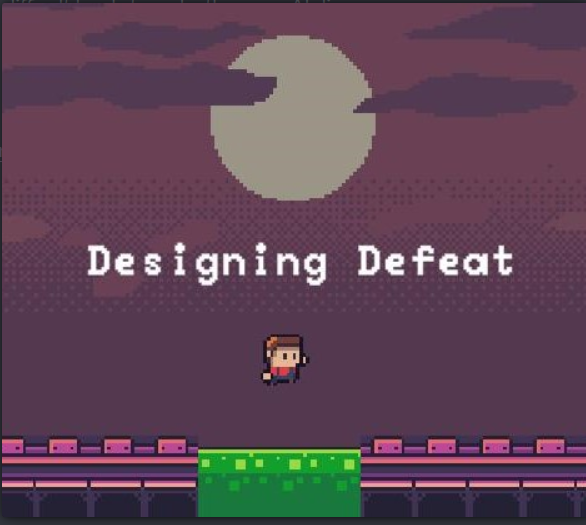

+++
title = 'Personal Projects'
date = 2024-09-21T23:15:45+03:00
draft = false
+++

##### [BUÜ Duyuru Bot](https://github.com/xash3000/buu_duyuru_bot)

A Telegram bot that automatically retrieves announcements from Bursa Uludağ University’s website and delivers real-time notifications to subscribed users.

##### [vsi](https://github.com/xash3000/vsi)

A minimalist turing-complete programming language with an interpreter implemented in Python.

##### [Coobalance](https://xash3000.itch.io/coobalance)

A co-op pc game, won 3rd place in ulujam game jam 2024.

##### [gol.py](https://github.com/xash3000/gol.py)

Conway's Game of Life implementation in python

##### [Matryoshka Dungeon](https://xash3000.itch.io/matryoshka-dungeon)

The winner game of Khartoum Game Jam 2020. A puzzle game made with Godot game engine.

##### [Square Roots Of Zombies](https://xash3000.itch.io/square-roots-of-zombies)

A game made for Global Game Jam 2023. A survival top-down shooter where you have to evaluate square root expressions before the zombies kill you.

##### [Designing Defeat](https://xash3000.itch.io/designing-defeat)

A game made for GMTK 2023. The gamer wears the hat of a level editor and tries to make the player charachter fail.

